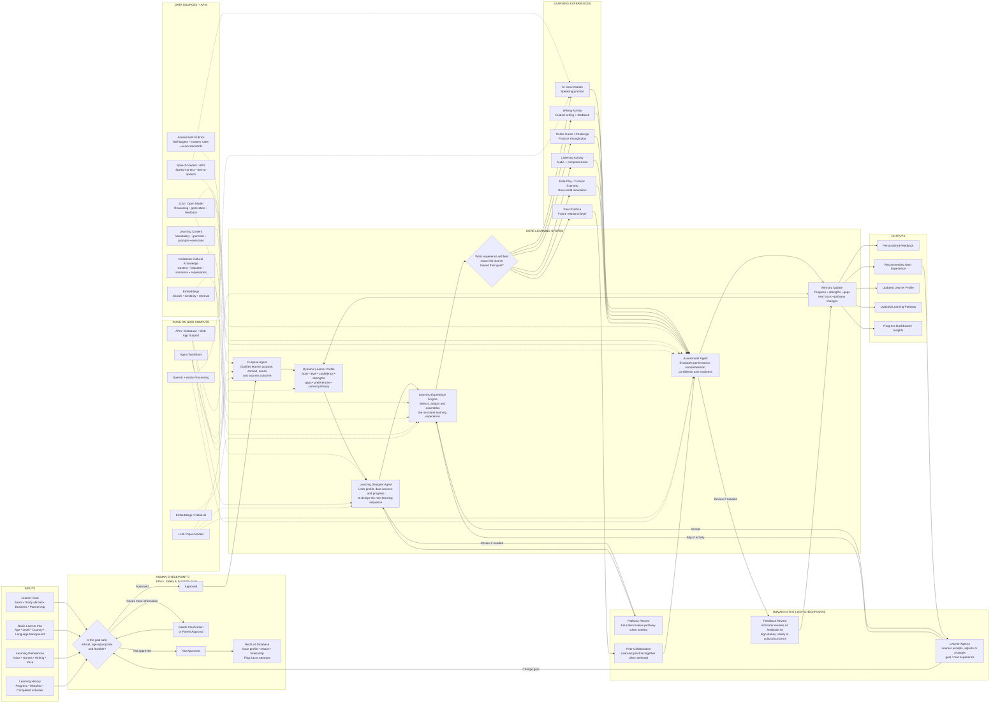

# Architecture

HablaCaribe is designed as an adaptive, agentic learning system.

The system does not simply generate content. Its core function is to choose the next best learning experience for each learner based on purpose, level, progress, confidence, and learning history.

## Workflow

## Key components

### Purpose Agent

Clarifies the learner's goal, context, needs, and success outcome.

### Dynamic Learner Profile

Stores the learner's goal, level, confidence, strengths, gaps, preferences, and current pathway.

### Learning Designer Agent

Uses the learner profile, learning content, cultural context, and assessment data to design the next learning sequence.

### Learning Experience Engine

Selects, adapts, and assembles the next best learning experience.

### Assessment Agent

Evaluates performance, comprehension, confidence, and readiness.

### Memory Update

Updates the learner profile with progress, strengths, gaps, next focus, and pathway changes.

## Human-in-the-loop design

Human checkpoints are built into the system for:

- ethics and safety review
- parent approval where needed
- educator pathway review
- high-stakes feedback review
- learner agency and goal adjustment
- future peer collaboration

The AI supports learning decisions. It does not replace human judgement.
